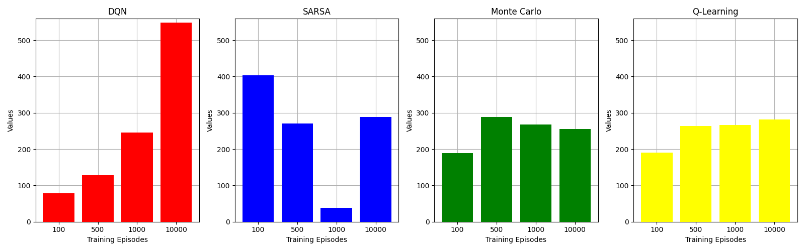
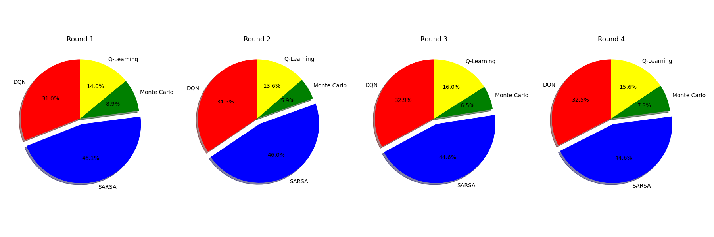

# Liar-s-Bar-RL

## Setup project

Clone project
```bash
git clone git@github.com:GFA03/Liar-s-Bar-RL.git
```
Create a virtual environment and activate it
```bash
python3 -m venv .venv
source .venv/bin/activate
```
Install all dependencies
```bash
pip install -r requirements.txt
```

## Running Tests

To run the tests, use the following command:
```bash
pytest tests/
```
## Game Description

General Rules:  
- At the start of the game, each player will have a revolver loaded with a single bullet out of the 6 possible chambers.
- The winner is the last player standing.
- Each round ends with the challenge of the previous player.
- The game is played in a counterclockwise direction, starting with the player who lost the previous round.

Rules per Round:
  -  A card from A / K / Q is chosen as the table card — each player is required to claim they are playing cards of that type.
  - Cards played are not revealed unless the player is challenged, meaning bluffing is possible, but the next player may challenge you.
  - Each player starts the round with 5 cards drawn from the following deck:

    - Q x6, A x6, K x6, Joker x2 (Jokers can be used as table cards).

  - You can play between 1-3 cards per turn, with the quantity being your choice.

  - You will not see the actual cards other players have played, only the number of cards.

    - When the player before you has played, there are four possible scenarios:
      1) You can challenge the player or play your own hand.
      2) If you challenge, the previous player’s cards are revealed.
      3) If all the cards are table cards, the challenger (you) must test their luck with the revolver (and you become the loser of the round, starting the next round if you survive).
      4) If not all the cards are table cards, the challenged player must fire the revolver at themselves (and they become the loser of the round).

## Approach
There have been considered 4 Reinforcement Learning algorithms which will be evaluated based on their performance across various numbers of training episodes. Additionally, these algorithms will compete against each other to determine their effectiveness in mastering the game.

### 1. Q-Learning
Q-Learning is a model-free reinforcement learning algorithm that learns an optimal action-selection policy by estimating the value of taking a specific action in a given state. It updates a Q-table iteratively, where each state-action pair is assigned a value representing the expected cumulative reward.

### 2. Monte Carlo
Monte Carlo is a reinforcement learning method that learns optimal policies by averaging rewards from sampled episodes. It relies on complete episodes to update value estimates, focusing on long-term rewards without requiring a model of the environment.

### 3. SARSA
SARSA (State-Action-Reward-State-Action) is an on-policy reinforcement learning algorithm that updates value estimates based on the action actually taken. It learns by following a policy, updating the Q-value using the current state, action, reward, next state, and next action, balancing exploration and exploitation.

### 4. DQN
DQN (Deep Q-Network) enhances Q-Learning by using a deep neural network to estimate Q-values, enabling it to tackle environments with large, complex state spaces. It incorporates techniques like experience replay and target networks to stabilize training and improve performance.

## Experiment
Initially each agent will play with a version of himself trained on a different number of episodes for 1000 matches.
The agent winning the most matches goes in the final.



In the final, the winning agent of each algorithm will play 4 rounds of 1000 matches 



## Strategies Overview
To analyze the strategy learned by each algorithm, the winning agents of each type will play with itself for a match  

- SARSA will try to challenge most of the time
- DQN will also challenge often but will try to play a few safe cards too
- Both Monte Carlo and Q-Learning doesnt seem to have a defined strategy
### DQN
```
0 {'num_players': 4, 'hand': [0, 2, 2, 1], 'table_card': 1, 'history': []}
1 {'num_players': 4, 'hand': [0, 2, 1, 2], 'table_card': 1, 'history': [1]}
2 {'num_players': 4, 'hand': [1, 1, 1, 2], 'table_card': 1, 'history': [1, 1]}
3 {'num_players': 4, 'hand': [1, 1, 2, 1], 'table_card': 1, 'history': [1, 1, 1]}
1 {'num_players': 4, 'hand': [0, 2, 2, 1], 'table_card': 2, 'history': []}
2 {'num_players': 4, 'hand': [1, 2, 1, 1], 'table_card': 2, 'history': [1]}
3 {'num_players': 4, 'hand': [1, 2, 1, 1], 'table_card': 2, 'history': [1, 1]}
0 {'num_players': 4, 'hand': [0, 0, 2, 3], 'table_card': 2, 'history': [1, 1, 1]}
2 {'num_players': 4, 'hand': [1, 1, 2, 1], 'table_card': 1, 'history': []}
3 {'num_players': 4, 'hand': [1, 2, 2, 0], 'table_card': 1, 'history': [1]}
0 {'num_players': 4, 'hand': [0, 1, 1, 3], 'table_card': 1, 'history': [1, 1]}
3 {'num_players': 4, 'hand': [2, 1, 0, 2], 'table_card': 3, 'history': []}
0 {'num_players': 4, 'hand': [0, 3, 2, 0], 'table_card': 3, 'history': [2]}
1 {'num_players': 4, 'hand': [0, 1, 1, 3], 'table_card': 3, 'history': [2, 2]}
0 {'num_players': 4, 'hand': [0, 0, 3, 2], 'table_card': 3, 'history': []}
1 {'num_players': 4, 'hand': [1, 1, 0, 3], 'table_card': 3, 'history': [1]}
1 {'num_players': 4, 'hand': [1, 2, 1, 1], 'table_card': 2, 'history': []}
2 {'num_players': 4, 'hand': [0, 1, 3, 1], 'table_card': 2, 'history': [1]}
3 {'num_players': 4, 'hand': [0, 1, 2, 2], 'table_card': 2, 'history': [1, 2]}
0 {'num_players': 4, 'hand': [1, 2, 0, 2], 'table_card': 2, 'history': [1, 2, 1]}
1 {'num_players': 4, 'hand': [1, 2, 1, 0], 'table_card': 2, 'history': [1, 2, 1, 1]}
2 {'num_players': 4, 'hand': [0, 0, 3, 0], 'table_card': 2, 'history': [1, 2, 1, 1, 1]}
2 {'num_players': 4, 'hand': [1, 2, 0, 2], 'table_card': 2, 'history': []}
3 {'num_players': 4, 'hand': [0, 1, 3, 1], 'table_card': 2, 'history': [1]}
0 {'num_players': 4, 'hand': [0, 2, 1, 2], 'table_card': 2, 'history': [1, 2]}
1 {'num_players': 4, 'hand': [1, 1, 2, 1], 'table_card': 2, 'history': [1, 2, 1]}
2 {'num_players': 3, 'hand': [0, 2, 1, 2], 'table_card': 2, 'history': []}
0 {'num_players': 3, 'hand': [2, 2, 0, 1], 'table_card': 2, 'history': [1]}
2 {'num_players': 3, 'hand': [0, 2, 1, 2], 'table_card': 3, 'history': []}
0 {'num_players': 3, 'hand': [0, 0, 3, 2], 'table_card': 3, 'history': [1]}
1 {'num_players': 3, 'hand': [0, 1, 2, 2], 'table_card': 3, 'history': [1, 1]}
2 {'num_players': 3, 'hand': [0, 2, 1, 1], 'table_card': 3, 'history': [1, 1, 1]}
2 {'num_players': 3, 'hand': [1, 2, 1, 1], 'table_card': 1, 'history': []}
0 {'num_players': 3, 'hand': [1, 1, 1, 2], 'table_card': 1, 'history': [1]}
1 {'num_players': 3, 'hand': [0, 1, 2, 2], 'table_card': 1, 'history': [1, 1]}
2 {'num_players': 3, 'hand': [1, 2, 1, 0], 'table_card': 1, 'history': [1, 1, 1]}
2 {'num_players': 3, 'hand': [0, 1, 1, 3], 'table_card': 1, 'history': []}
0 {'num_players': 3, 'hand': [0, 3, 2, 0], 'table_card': 1, 'history': [1]}
2 {'num_players': 3, 'hand': [0, 2, 2, 1], 'table_card': 1, 'history': []}
0 {'num_players': 3, 'hand': [1, 0, 2, 2], 'table_card': 1, 'history': [1]}
0 {'num_players': 2, 'hand': [0, 0, 3, 2], 'table_card': 1, 'history': []}
1 {'num_players': 2, 'hand': [1, 1, 0, 3], 'table_card': 1, 'history': [1]}
0 {'num_players': 2, 'hand': [0, 0, 3, 1], 'table_card': 1, 'history': [1, 1]}
1 {'num_players': 2, 'hand': [0, 1, 0, 3], 'table_card': 1, 'history': [1, 1, 1]}
0 {'num_players': 2, 'hand': [0, 2, 1, 2], 'table_card': 3, 'history': []}
1 {'num_players': 2, 'hand': [0, 2, 1, 2], 'table_card': 3, 'history': [1]}
0 {'num_players': 2, 'hand': [0, 2, 1, 1], 'table_card': 3, 'history': [1, 1]}
0 {'num_players': 2, 'hand': [0, 2, 2, 1], 'table_card': 1, 'history': []}
1 {'num_players': 2, 'hand': [0, 2, 2, 1], 'table_card': 1, 'history': [1]}
0 {'num_players': 2, 'hand': [0, 2, 2, 0], 'table_card': 1, 'history': [1, 2]}
0 {'num_players': 2, 'hand': [1, 2, 1, 1], 'table_card': 2, 'history': []}
1 {'num_players': 2, 'hand': [0, 1, 4, 0], 'table_card': 2, 'history': [1]}
0 {'num_players': 2, 'hand': [1, 2, 1, 0], 'table_card': 2, 'history': [1, 1]}
0 {'num_players': 2, 'hand': [1, 1, 1, 2], 'table_card': 1, 'history': []}
1 {'num_players': 2, 'hand': [0, 2, 3, 0], 'table_card': 1, 'history': [1]}
0 {'num_players': 2, 'hand': [1, 1, 1, 1], 'table_card': 1, 'history': [1, 2]}
1 {'num_players': 2, 'hand': [0, 0, 3, 0], 'table_card': 1, 'history': [1, 2, 2]}
Winner: [0, 0, 1, 0]
```

### SARSA
```
0 {'num_players': 4, 'hand': [0, 1, 3, 1], 'table_card': 3, 'history': []}
1 {'num_players': 4, 'hand': [2, 1, 1, 1], 'table_card': 3, 'history': [1]}
2 {'num_players': 4, 'hand': [0, 2, 2, 1], 'table_card': 3, 'history': [1, 1]}
1 {'num_players': 4, 'hand': [0, 1, 3, 1], 'table_card': 3, 'history': []}
2 {'num_players': 4, 'hand': [0, 0, 1, 4], 'table_card': 3, 'history': [1]}
2 {'num_players': 4, 'hand': [0, 2, 1, 2], 'table_card': 2, 'history': []}
3 {'num_players': 4, 'hand': [1, 1, 2, 1], 'table_card': 2, 'history': [1]}
3 {'num_players': 4, 'hand': [0, 1, 2, 2], 'table_card': 1, 'history': []}
0 {'num_players': 4, 'hand': [0, 2, 1, 2], 'table_card': 1, 'history': [2]}
0 {'num_players': 4, 'hand': [1, 2, 1, 1], 'table_card': 1, 'history': []}
1 {'num_players': 4, 'hand': [1, 1, 1, 2], 'table_card': 1, 'history': [2]}
1 {'num_players': 4, 'hand': [0, 2, 2, 1], 'table_card': 2, 'history': []}
2 {'num_players': 4, 'hand': [1, 1, 1, 2], 'table_card': 2, 'history': [1]}
3 {'num_players': 4, 'hand': [0, 2, 1, 2], 'table_card': 2, 'history': [1, 2]}
2 {'num_players': 4, 'hand': [0, 1, 3, 1], 'table_card': 3, 'history': []}
3 {'num_players': 4, 'hand': [0, 1, 0, 4], 'table_card': 3, 'history': [1]}
0 {'num_players': 3, 'hand': [1, 0, 2, 2], 'table_card': 2, 'history': []}
1 {'num_players': 3, 'hand': [1, 2, 0, 2], 'table_card': 2, 'history': [1]}
1 {'num_players': 3, 'hand': [0, 2, 1, 2], 'table_card': 1, 'history': []}
2 {'num_players': 3, 'hand': [1, 1, 2, 1], 'table_card': 1, 'history': [1]}
2 {'num_players': 3, 'hand': [1, 2, 1, 1], 'table_card': 3, 'history': []}
0 {'num_players': 3, 'hand': [0, 1, 2, 2], 'table_card': 3, 'history': [1]}
1 {'num_players': 3, 'hand': [1, 0, 1, 3], 'table_card': 3, 'history': [1, 1]}
0 {'num_players': 3, 'hand': [0, 3, 1, 1], 'table_card': 3, 'history': []}
1 {'num_players': 3, 'hand': [0, 0, 3, 2], 'table_card': 3, 'history': [1]}
1 {'num_players': 2, 'hand': [1, 1, 1, 2], 'table_card': 2, 'history': []}
0 {'num_players': 2, 'hand': [0, 2, 1, 2], 'table_card': 2, 'history': [1]}
1 {'num_players': 2, 'hand': [0, 2, 3, 0], 'table_card': 2, 'history': []}
0 {'num_players': 2, 'hand': [2, 2, 0, 1], 'table_card': 2, 'history': [1]}
Winner: [0, 0, 1, 0]

```

### Monte Carlo
```
0 {'num_players': 4, 'hand': [0, 1, 2, 2], 'table_card': 2, 'history': []}
1 {'num_players': 4, 'hand': [0, 3, 1, 1], 'table_card': 2, 'history': [1]}
2 {'num_players': 4, 'hand': [1, 1, 1, 2], 'table_card': 2, 'history': [1, 1]}
3 {'num_players': 4, 'hand': [1, 1, 2, 1], 'table_card': 2, 'history': [1, 1, 1]}
0 {'num_players': 4, 'hand': [0, 1, 1, 2], 'table_card': 2, 'history': [1, 1, 1, 1]}
1 {'num_players': 4, 'hand': [0, 1, 3, 1], 'table_card': 2, 'history': []}
2 {'num_players': 4, 'hand': [0, 2, 1, 2], 'table_card': 2, 'history': [1]}
3 {'num_players': 4, 'hand': [1, 2, 1, 1], 'table_card': 2, 'history': [1, 1]}
0 {'num_players': 4, 'hand': [1, 1, 1, 2], 'table_card': 2, 'history': [1, 1, 1]}
1 {'num_players': 4, 'hand': [0, 1, 2, 1], 'table_card': 2, 'history': [1, 1, 1, 1]}
2 {'num_players': 4, 'hand': [0, 2, 0, 2], 'table_card': 2, 'history': [1, 1, 1, 1, 3]}
3 {'num_players': 4, 'hand': [1, 2, 0, 1], 'table_card': 2, 'history': [1, 1, 1, 1, 3, 1]}
0 {'num_players': 4, 'hand': [1, 1, 0, 2], 'table_card': 2, 'history': [1, 1, 1, 1, 3, 1, 2]}
1 {'num_players': 4, 'hand': [0, 0, 1, 0], 'table_card': 2, 'history': [1, 1, 1, 1, 3, 1, 2, 3]}
1 {'num_players': 3, 'hand': [0, 2, 1, 2], 'table_card': 3, 'history': []}
2 {'num_players': 3, 'hand': [0, 2, 1, 2], 'table_card': 3, 'history': [2]}
0 {'num_players': 3, 'hand': [1, 2, 1, 1], 'table_card': 3, 'history': [2, 2]}
1 {'num_players': 2, 'hand': [1, 3, 1, 0], 'table_card': 2, 'history': []}
0 {'num_players': 2, 'hand': [1, 0, 1, 3], 'table_card': 2, 'history': [1]}
1 {'num_players': 2, 'hand': [1, 1, 1, 2], 'table_card': 1, 'history': []}
0 {'num_players': 2, 'hand': [0, 3, 1, 1], 'table_card': 1, 'history': [1]}
1 {'num_players': 2, 'hand': [1, 0, 1, 2], 'table_card': 1, 'history': [1, 1]}
0 {'num_players': 2, 'hand': [0, 2, 1, 1], 'table_card': 1, 'history': [1, 1, 2]}
1 {'num_players': 2, 'hand': [2, 1, 1, 1], 'table_card': 2, 'history': []}
0 {'num_players': 2, 'hand': [0, 2, 2, 1], 'table_card': 2, 'history': [1]}
1 {'num_players': 2, 'hand': [2, 1, 0, 1], 'table_card': 2, 'history': [1, 1]}
0 {'num_players': 2, 'hand': [0, 2, 1, 1], 'table_card': 2, 'history': [1, 1, 2]}
1 {'num_players': 2, 'hand': [0, 1, 0, 1], 'table_card': 2, 'history': [1, 1, 2, 3]}
0 {'num_players': 2, 'hand': [0, 1, 0, 0], 'table_card': 2, 'history': [1, 1, 2, 3, 2]}
1 {'num_players': 2, 'hand': [0, 2, 2, 1], 'table_card': 1, 'history': []}
0 {'num_players': 2, 'hand': [0, 2, 2, 1], 'table_card': 1, 'history': [2]}
1 {'num_players': 2, 'hand': [0, 2, 1, 2], 'table_card': 1, 'history': []}
0 {'num_players': 2, 'hand': [1, 2, 1, 1], 'table_card': 1, 'history': [1]}
1 {'num_players': 2, 'hand': [0, 1, 1, 2], 'table_card': 1, 'history': [1, 1]}
1 {'num_players': 2, 'hand': [0, 2, 2, 1], 'table_card': 3, 'history': []}
0 {'num_players': 2, 'hand': [0, 3, 2, 0], 'table_card': 3, 'history': [3]}
1 {'num_players': 2, 'hand': [0, 2, 1, 2], 'table_card': 3, 'history': []}
0 {'num_players': 2, 'hand': [0, 1, 3, 1], 'table_card': 3, 'history': [2]}
1 {'num_players': 2, 'hand': [0, 2, 1, 0], 'table_card': 3, 'history': [2, 1]}
Winner: [0, 1, 0, 0]
```

### Q-Learning
```
0 {'num_players': 4, 'hand': [1, 1, 2, 1], 'table_card': 3, 'history': []}
1 {'num_players': 4, 'hand': [0, 2, 0, 3], 'table_card': 3, 'history': [1]}
2 {'num_players': 4, 'hand': [1, 0, 3, 1], 'table_card': 3, 'history': [1, 1]}
3 {'num_players': 4, 'hand': [0, 3, 1, 1], 'table_card': 3, 'history': [1, 1, 1]}
0 {'num_players': 4, 'hand': [1, 1, 2, 0], 'table_card': 3, 'history': [1, 1, 1, 1]}
1 {'num_players': 4, 'hand': [0, 2, 0, 2], 'table_card': 3, 'history': [1, 1, 1, 1, 1]}
2 {'num_players': 4, 'hand': [1, 0, 3, 0], 'table_card': 3, 'history': [1, 1, 1, 1, 1, 1]}
3 {'num_players': 4, 'hand': [0, 3, 1, 0], 'table_card': 3, 'history': [1, 1, 1, 1, 1, 1, 1]}
0 {'num_players': 4, 'hand': [1, 1, 1, 0], 'table_card': 3, 'history': [1, 1, 1, 1, 1, 1, 1, 1]}
1 {'num_players': 4, 'hand': [0, 2, 0, 1], 'table_card': 3, 'history': [1, 1, 1, 1, 1, 1, 1, 1, 1]}
1 {'num_players': 4, 'hand': [0, 0, 3, 2], 'table_card': 3, 'history': []}
2 {'num_players': 4, 'hand': [0, 2, 1, 2], 'table_card': 3, 'history': [2]}
3 {'num_players': 4, 'hand': [1, 2, 1, 1], 'table_card': 3, 'history': [2, 2]}
2 {'num_players': 4, 'hand': [1, 3, 1, 0], 'table_card': 3, 'history': []}
3 {'num_players': 4, 'hand': [1, 2, 2, 0], 'table_card': 3, 'history': [3]}
0 {'num_players': 4, 'hand': [0, 1, 0, 4], 'table_card': 3, 'history': [3, 3]}
3 {'num_players': 4, 'hand': [1, 1, 1, 2], 'table_card': 2, 'history': []}
0 {'num_players': 4, 'hand': [0, 0, 3, 2], 'table_card': 2, 'history': [3]}
1 {'num_players': 4, 'hand': [1, 2, 1, 1], 'table_card': 2, 'history': [3, 3]}
2 {'num_players': 4, 'hand': [0, 3, 1, 1], 'table_card': 2, 'history': [3, 3, 3]}
3 {'num_players': 4, 'hand': [0, 0, 0, 2], 'table_card': 2, 'history': [3, 3, 3, 3]}
0 {'num_players': 4, 'hand': [0, 2, 3, 0], 'table_card': 1, 'history': []}
1 {'num_players': 4, 'hand': [1, 2, 1, 1], 'table_card': 1, 'history': [1]}
2 {'num_players': 4, 'hand': [1, 1, 0, 3], 'table_card': 1, 'history': [1, 2]}
1 {'num_players': 4, 'hand': [1, 0, 3, 1], 'table_card': 2, 'history': []}
2 {'num_players': 4, 'hand': [0, 2, 0, 3], 'table_card': 2, 'history': [2]}
3 {'num_players': 4, 'hand': [1, 3, 1, 0], 'table_card': 2, 'history': [2, 1]}
2 {'num_players': 4, 'hand': [0, 1, 2, 2], 'table_card': 1, 'history': []}
3 {'num_players': 4, 'hand': [1, 0, 2, 2], 'table_card': 1, 'history': [3]}
0 {'num_players': 4, 'hand': [1, 1, 1, 2], 'table_card': 1, 'history': [3, 3]}
0 {'num_players': 3, 'hand': [1, 1, 2, 1], 'table_card': 2, 'history': []}
1 {'num_players': 3, 'hand': [0, 3, 1, 1], 'table_card': 2, 'history': [2]}
2 {'num_players': 3, 'hand': [0, 1, 3, 1], 'table_card': 2, 'history': [2, 1]}
1 {'num_players': 3, 'hand': [1, 1, 1, 2], 'table_card': 3, 'history': []}
2 {'num_players': 3, 'hand': [0, 1, 2, 2], 'table_card': 3, 'history': [3]}
0 {'num_players': 3, 'hand': [0, 2, 2, 1], 'table_card': 3, 'history': [3, 1]}
1 {'num_players': 3, 'hand': [1, 0, 1, 0], 'table_card': 3, 'history': [3, 1, 1]}
2 {'num_players': 3, 'hand': [0, 1, 2, 2], 'table_card': 1, 'history': []}
0 {'num_players': 3, 'hand': [0, 3, 1, 1], 'table_card': 1, 'history': [3]}
1 {'num_players': 3, 'hand': [2, 1, 1, 1], 'table_card': 1, 'history': [3, 1]}
0 {'num_players': 3, 'hand': [0, 2, 2, 1], 'table_card': 2, 'history': []}
1 {'num_players': 3, 'hand': [0, 2, 1, 2], 'table_card': 2, 'history': [3]}
2 {'num_players': 3, 'hand': [1, 2, 1, 1], 'table_card': 2, 'history': [3, 1]}
0 {'num_players': 3, 'hand': [0, 0, 1, 1], 'table_card': 2, 'history': [3, 1, 2]}
1 {'num_players': 3, 'hand': [1, 0, 0, 4], 'table_card': 2, 'history': []}
2 {'num_players': 3, 'hand': [1, 2, 0, 2], 'table_card': 2, 'history': [1]}
0 {'num_players': 3, 'hand': [0, 1, 4, 0], 'table_card': 2, 'history': [1, 1]}
1 {'num_players': 3, 'hand': [1, 0, 0, 3], 'table_card': 2, 'history': [1, 1, 1]}
2 {'num_players': 3, 'hand': [0, 1, 2, 2], 'table_card': 1, 'history': []}
0 {'num_players': 3, 'hand': [1, 1, 2, 1], 'table_card': 1, 'history': [3]}
1 {'num_players': 3, 'hand': [1, 2, 1, 1], 'table_card': 1, 'history': [3, 3]}
2 {'num_players': 3, 'hand': [0, 1, 0, 1], 'table_card': 1, 'history': [3, 3, 1]}
0 {'num_players': 2, 'hand': [2, 1, 1, 1], 'table_card': 2, 'history': []}
1 {'num_players': 2, 'hand': [0, 1, 3, 1], 'table_card': 2, 'history': [1]}
0 {'num_players': 2, 'hand': [2, 1, 1, 0], 'table_card': 2, 'history': [1, 3]}
1 {'num_players': 2, 'hand': [0, 1, 0, 1], 'table_card': 2, 'history': [1, 3, 2]}
0 {'num_players': 2, 'hand': [0, 1, 1, 0], 'table_card': 2, 'history': [1, 3, 2, 2]}
Winner: [1, 0, 0, 0]
```